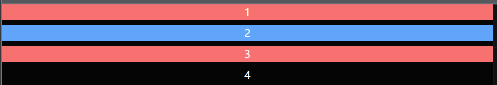
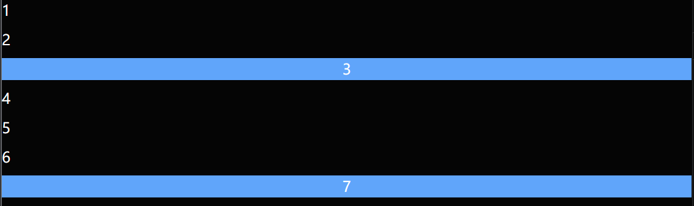

## children-[]

> 通过 `children`， 指定目标子元素下的样式
>
> 生成的 css 通过 `>` 分隔符关联
>
> [UnoCSS Playground](https://unocss.dev/play/?html=DwEwlgbgBAxgNgQwM5ILwCIkAcEwKYC0AngQEywAWYcIATngHYEDa4EAugFwBGA5gfRCVqdRiwB0AFwS1eeSVz4FucAK55hNek2aS8AD0kEEcMLwad8DPbXboAfACgoUUJHsBGYAHo2Tl27Q8Mho6NKy8g6kPn7OrrEuAWywiCgY4XKSDgDMMe5xeRD%2BrtgIDCkhGADuBABmqnBwUCoA9jAA1g4ALD6lDE6FTkA&config=JYWwDg9gTgLgBAbwLACg5wCYFMBmwB2WAwhPngOYA0q6YUWAzljAIIwxTABGArjMDgCe1NHDqNmASQDGpBiNr0mMAKr4IIgL5wcUCCDgByHuukMGh1KiwAPSLEy4AhjwA28bHkIkywcgApkUSg3RgAuOABtGnQow2keBhh9AFoQ1yxDSkQ4WVdoCMN6DEM4TQBdGPKFOAYAC2gYBJgGCKDYowSk1PrG5sNCmFsYFNdyOCGbEegnfHIsOAaANywoMMmRoadXS1FNGvFlVqiYxQlVdX8AShqz5TYObj4BQWvbsSUpWXwGQNPYhjSbZYCIARgAdAAmd7oaQYfCFOrsMCtAD0qMYIHB9VRuw6mhuVVQBNQQA&css=Q&options=N4XyA)

1. 所有子元素: `children:bg-red`  `children-[text-align:center]`

2. 指定特定子元素: `children-[div]:bg-red` `children-[.target]-[text-align:center]`

```html
<div class="space-y-2 children-[div]:bg-red children-[.target]:bg-blue children-[text-align:center]">
  <div>1</div>
  <div class="target">2</div>
  <div>
    <div class="target">3</div>
  </div>
  <span class="w-full block">4</span>
</div>
```




---

## next-[]

> 通过 `next`, 指定目标相邻元素的样式
>
> 生成的 css 通过 `+` 分隔符关联
>
> [UnoCSS Playground](https://unocss.dev/play/?html=DwEwlgbgBAxgNgQwM5ILwCIkAcEwKYC0AngQExToB8AUFFKJJQIzAD04ENdD08ya6AHZ4AHgBcAXACMA5gSlwArnijDxBANpjRYggjhgZgifkHaATgF0qpNhy717AZjuNajyLEQoMa3RoA6MQRzGTwxS2k5BWUqABZXTnceSgBWRIceL35fHU0gkLCIqPklFT9NDktNbXV9Q2NTC2tKADYM5I5sn3Rg0PCqAHYOjqA&config=JYWwDg9gTgLgBAbwLACg5wCYFMBmwB2WAwhPngOYA0q6YUWAzljAIIwxTABGArjMDgCe1NHDqNmASQDGpBiNr0mMAKr4IIgL5wcUCCDgByHuukMGh1KiwAPSLEy4AhjwA28bHkIkywcgApkUSg3RgAuOABtGnQow2keBhh9AFoQ1yxDSkQ4WVdoCMN6DEM4TQBdGPKFOAYAC2gYBJgGCKDYowSk1PrG5sNCmFsYFNdyOCGbEegnfHIsOAaANywoMMmRoadXS1FNGvFlVqiYxQlVdX8AShqz5TYObj4BQWvbsSUpWXwGQNPYhjSbZYCIARgAdAAmd7oaQYfCFOrsMCtAD0qMYIHB9VRuw6mhuVVQBNQQA&css=Q&options=N4XyA)

1. 相邻元素: `next:bg-blue` `next-[text-align:center]`
2. 特定相邻元素： `next-[.target]:bg-blue`  `next-[div]-[text-align:center]`

```html
<div class="space-y-2 ">
  <div>1</div>
  <div class="next:bg-blue next-[text-align:center]">2</div>
  <div>3</div>
  <div class="next-[.target]:bg-blue">4</div>
  <div>5</div>
  <div class="next-[.target]:bg-blue next-[div]-[text-align:center]">6</div>
  <div class="target">7</div>
</div>
```


